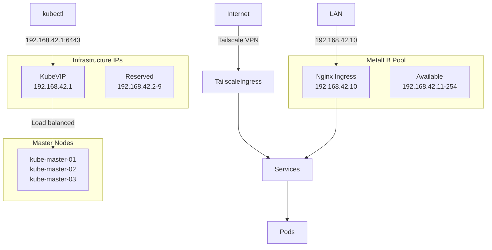

# Kubernetes Infrastructure

This repository contains the complete Kubernetes cluster configuration managed via GitOps principles using ArgoCD and Kustomize.

## 🌐 Network Architecture & IP Allocation

### Control Plane & Load Balancing

| Service           | IP Address      | Purpose             | Notes                               |
| ----------------- | --------------- | ------------------- | ----------------------------------- |
| **KubeVIP**       | `192.168.42.1`  | Control plane VIP   | High availability API server access |
| **Ingress-NGINX** | `192.168.42.10` | External LAN access | LoadBalancer service via MetalLB    |

### Infrastructure IP Ranges

| Range                          | Purpose           | Provider | Description                                |
| ------------------------------ | ----------------- | -------- | ------------------------------------------ |
| `192.168.42.1-192.168.42.9`    | Infrastructure    | Reserved | KubeVIP and future infrastructure services |
| `192.168.42.10-192.168.42.254` | LoadBalancer Pool | MetalLB  | Available IPs for LoadBalancer services    |

### Node Network Configuration

#### Control Plane Nodes

| Node               | LAN IP          | Tailscale IP      | Role                |
| ------------------ | --------------- | ----------------- | ------------------- |
| **kube-master-01** | `192.168.0.94`  | `100.97.38.47`    | Control Plane, etcd |
| **kube-master-02** | `192.168.0.153` | `100.122.123.119` | Control Plane, etcd |
| **kube-master-03** | `192.168.0.202` | `100.123.21.88`   | Control Plane, etcd |

#### Worker Nodes

| Node                | LAN IP          | Tailscale IP    | Role   | Special Features                    |
| ------------------- | --------------- | --------------- | ------ | ----------------------------------- |
| **kube-big-01**     | `192.168.0.55`  | `100.83.110.81` | Worker | High-performance (AMD Ryzen 7 2700) |
| **kube-storage-01** | `192.168.0.41`  | `100.101.83.66` | Worker | NVMe storage, Longhorn              |
| **kube-storage-02** | `192.168.0.38`  | `100.93.95.94`  | Worker | NVMe storage, Longhorn              |
| **kube-storage-03** | `192.168.0.134` | `100.87.45.82`  | Worker | NVMe storage, Longhorn              |

### Internal Kubernetes Networking

| Network                   | CIDR           | Purpose                  |
| ------------------------- | -------------- | ------------------------ |
| **Pod Network (Flannel)** | `10.42.0.0/16` | Pod-to-pod communication |
| **Service Network**       | `10.43.0.0/16` | ClusterIP services       |
| **Tailscale VPN**         | `100.x.x.x/32` | Secure external access   |

### Service Access Methods

#### External Access (LAN)

- **Primary Entry Point**: `192.168.42.10` (Ingress-NGINX)
- **Kubernetes API**: `192.168.42.1:6443` (KubeVIP)

#### Secure Remote Access (Tailscale)

- **Domain Pattern**: `*.beaver-cloud.xyz`
- **Examples**:
  - ArgoCD: `argocd.beaver-cloud.xyz`
  - Jellyfin: `jellyfin.beaver-cloud.xyz`
  - Victoria Metrics: `victoria-metrics.beaver-cloud.xyz`

### Network Traffic Flow



## 🏗️ Architecture Overview

### Deployment Stack

- **OS**: Fedora CoreOS (uCore minimal)
- **Kubernetes**: K3s v1.32.6
- **Container Runtime**: containerd 2.0.5
- **GitOps**: ArgoCD
- **Ingress**: NGINX Ingress Controller + Tailscale
- **Load Balancer**: MetalLB (Layer 2)
- **Storage**: Longhorn (distributed block storage)
- **Monitoring**: Victoria Metrics
- **Security**: Tailscale VPN, cert-manager

### Key Components

| Component              | Namespace         | Access                              | Purpose                        |
| ---------------------- | ----------------- | ----------------------------------- | ------------------------------ |
| **ArgoCD**             | `argocd`          | `argocd.beaver-cloud.xyz`           | GitOps continuous deployment   |
| **Longhorn**           | `longhorn-system` | `longhorn.beaver-cloud.xyz`         | Distributed storage management |
| **Victoria Metrics**   | `monitoring`      | `victoria-metrics.beaver-cloud.xyz` | Metrics and monitoring         |
| **Tailscale Operator** | `tailscale`       | -                                   | VPN and secure ingress         |
| **Sealed Secrets**     | `kube-system`     | -                                   | Secret management              |
| **MetalLB**            | `metallb-system`  | -                                   | LoadBalancer IP allocation     |

## 📖 Documentation

For detailed information, see:

- [CLAUDE.md](./CLAUDE.md) - Claude Code assistant instructions and workflows
- [GUIDELINES.md](./GUIDELINES.md) - Standard procedures for adding new services
- [kubernetes-hardware-inventory.md](./kubernetes-hardware-inventory.md) - Complete hardware specifications

## 🚀 Quick Start

### Common Operations

```bash
# Build and validate all manifests
task k8s:build-all
task k8s:validate

# Get ArgoCD admin password
kubectl -n argocd get secret argocd-initial-admin-secret -o jsonpath="{.data.password}" | base64 -d

# Force refresh an ArgoCD application
task argo:refresh-app appname=APPLICATION_NAME

# Update /etc/hosts with ingress domains
task k8s:update-hosts
```

### Access Points

- **ArgoCD Dashboard**: https://argocd.beaver-cloud.xyz
- **Kubernetes API**: https://192.168.42.1:6443
- **Longhorn Dashboard**: https://longhorn.beaver-cloud.xyz
- **Victoria Metrics**: https://victoria-metrics.beaver-cloud.xyz

## 🔒 Security

- **Network Isolation**: Tailscale mesh VPN for secure external access
- **Certificate Management**: Wildcard certificates via cert-manager + Cloudflare
- **Secret Management**: Sealed Secrets for GitOps-safe secret storage
- **Network Policies**: Pod-to-pod communication controls
- **RBAC**: Role-based access control throughout the cluster

## 📊 Cluster Stats

- **Total Nodes**: 7 (3 control plane, 4 workers)
- **Total CPU Cores**: 30 (8 AMD + 22 Intel)
- **Total Memory**: 102.4GB
- **Total Storage**: 2.5TB+ distributed across nodes
- **High Availability**: 3-node control plane with KubeVIP
- **Storage Replication**: 3x replication via Longhorn
