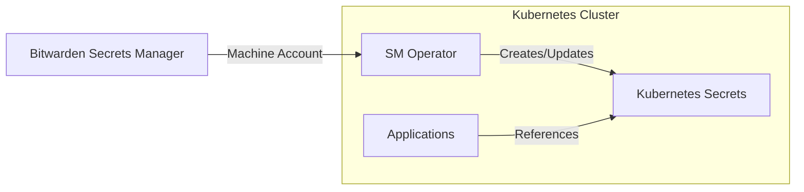

# Bitwarden Secrets Manager Integration

This directory contains the Kubernetes configuration for integrating Bitwarden Secrets Manager with the cluster using the official Bitwarden Secrets Manager Kubernetes Operator.

## Overview

The Bitwarden Secrets Manager operator enables secure synchronization of secrets from Bitwarden Secrets Manager into Kubernetes secrets, providing a centralized and secure way to manage application secrets.

## Architecture



## Components

### 1. Namespace (`namespace.yml`)

- Creates the `bitwarden-secrets` namespace with appropriate pod security standards

### 2. SM Operator (`sm-operator/`)

- **Helm Application**: Deploys the official Bitwarden SM operator
- **Authentication Secret**: Stores the encrypted machine account token
- **Example Configuration**: Shows how to create BitwardenSecret resources

## Setup Process

### Prerequisites

1. **Bitwarden Secrets Manager Organization**: Access to a Bitwarden Secrets Manager organization
2. **Machine Account**: Create a machine account in your organization
3. **Access Token**: Generate an access token for the machine account

### Step 1: Create Machine Account Token

1. Log into your Bitwarden Secrets Manager organization
2. Navigate to **Machine Accounts**
3. Create a new machine account or select an existing one
4. Generate an **Access Token** for the machine account
5. Copy the token (you'll need it in the next step)

### Step 2: Create Authentication Secret

**Option A: Using the provided script (recommended)**

```bash
cd apps/bitwarden-secrets/sm-operator/resources/
./create-auth-secret.sh "your-machine-account-token-here"
```

**Option B: Manual creation**

```bash
kubectl create secret generic bitwarden-auth-token \
  --namespace=bitwarden-secrets \
  --from-literal=token="your-machine-account-token-here" \
  --dry-run=client -o yaml | kubeseal -o yaml
```

### Step 3: Update the SealedSecret

1. Replace the content of `auth-secret.yml` with the generated sealed secret
2. Commit and push the changes
3. Delete any temporary files containing the sealed secret

### Step 4: Deploy via ArgoCD

The operator will be automatically deployed by ArgoCD once the changes are pushed to the repository.

## Usage

### Creating a BitwardenSecret

Create a `BitwardenSecret` resource to sync secrets from Bitwarden Secrets Manager:

```yaml
apiVersion: k8s.bitwarden.com/v1
kind: BitwardenSecret
metadata:
  name: my-app-secrets
  namespace: my-app-namespace
spec:
  organizationId: '12345678-1234-1234-1234-123456789abc'
  secretName: my-app-secret
  map:
    - bwSecretId: 'secret-uuid-1'
      secretKeyName: database_password
    - bwSecretId: 'secret-uuid-2'
      secretKeyName: api_key
  authToken:
    secretName: bitwarden-auth-token
    secretKey: token
  refreshInterval: '10m'
```

### Using the Synced Secret

Reference the created Kubernetes secret in your applications:

```yaml
apiVersion: apps/v1
kind: Deployment
metadata:
  name: my-app
spec:
  template:
    spec:
      containers:
        - name: app
          image: my-app:latest
          env:
            - name: DATABASE_PASSWORD
              valueFrom:
                secretKeyRef:
                  name: my-app-secret
                  key: database_password
            - name: API_KEY
              valueFrom:
                secretKeyRef:
                  name: my-app-secret
                  key: api_key
```

## Finding Required IDs

### Organization ID

1. Go to your Bitwarden Secrets Manager organization settings
2. The Organization ID is displayed in the organization details

### Secret UUIDs

1. Navigate to your secrets in Bitwarden Secrets Manager
2. Click on a secret to view its details
3. The UUID is visible in the URL or secret details

Example URL: `https://vault.bitwarden.com/sm/secrets/12345678-abcd-1234-5678-123456789abc`
The UUID is: `12345678-abcd-1234-5678-123456789abc`

## Monitoring and Troubleshooting

### Check Operator Status

```bash
# Check operator deployment
kubectl get deployment sm-operator -n bitwarden-secrets

# Check operator logs
kubectl logs deployment/sm-operator -n bitwarden-secrets
```

### Check BitwardenSecret Status

```bash
# List all BitwardenSecrets
kubectl get bitwardensecret -A

# Check a specific BitwardenSecret
kubectl describe bitwardensecret my-app-secrets -n my-app-namespace
```

### Force Refresh a Secret

```bash
kubectl annotate bitwardensecret my-app-secrets \
  --namespace=my-app-namespace \
  bitwarden.com/force-sync=$(date +%s)
```

## Security Considerations

1. **Machine Account Token**: The token is stored as a SealedSecret, encrypted at rest
2. **Namespace Isolation**: The operator runs in its own namespace with appropriate RBAC
3. **Least Privilege**: Machine accounts should only have access to required secrets
4. **Regular Rotation**: Consider rotating machine account tokens periodically

## Configuration Reference

### BitwardenSecret Spec

| Field                  | Type   | Required | Description                                  |
| ---------------------- | ------ | -------- | -------------------------------------------- |
| `organizationId`       | string | Yes      | Bitwarden organization UUID                  |
| `secretName`           | string | Yes      | Name of the resulting Kubernetes secret      |
| `map`                  | array  | Yes      | Array of secret mappings                     |
| `map[].bwSecretId`     | string | Yes      | UUID of the Bitwarden secret                 |
| `map[].secretKeyName`  | string | Yes      | Key name in the Kubernetes secret            |
| `authToken.secretName` | string | Yes      | Name of the secret containing the auth token |
| `authToken.secretKey`  | string | Yes      | Key in the auth secret (usually "token")     |
| `refreshInterval`      | string | No       | How often to sync (default: "15m")           |

### Supported Refresh Intervals

- `30s` - 30 seconds
- `5m` - 5 minutes
- `15m` - 15 minutes (default)
- `1h` - 1 hour
- `24h` - 24 hours
